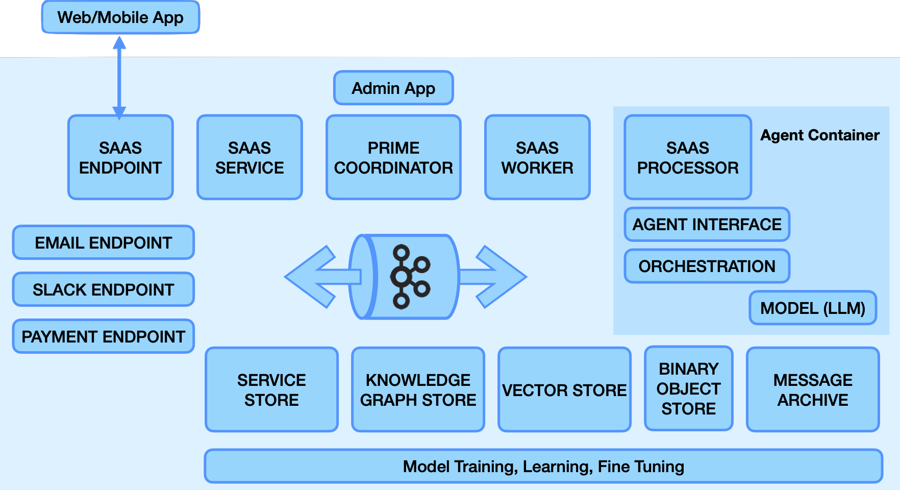

# vital-agent-ecosystem

The Vital Agent Ecosystem provides a collection of software components, knowledge models, and interfaces that together provide an A.I. Agent deployment and management platform.

Commercial support of the Vital AI Agent Ecosystem is provided by Vital AI: [https://www.vital.ai](https://www.vital.ai)

This repository provides documentation and resources for the Agent Ecosystem as a whole.

Documentation is managed on the wiki, here: [Wiki](https://github.com/vital-ai/vital-agent-ecosystem/wiki).

The Agent Ecosystem is comprised of the individual components in the table below, which are maintained in separate repositories.

| Name                          | Link                                                           | Description              |
|-------------------------------|----------------------------------------------------------------|--------------------------|
| vitalhome-aimp                | [Link](https://github.com/vital-ai/vitalhome-aimp)              | Knowledge Model for Artificial Intelligence Messaging Protocol |
| vitalhome-knowledge-graph     | [Link](https://github.com/vital-ai/vitalhome-knowledge-graph)   | Knowledge Model for core Knowledge Graph concepts |
| vital-client-python           | [Link](https://github.com/vital-ai/vital-client-python)         | Python Client to access Agent Ecosystem |
| vital-client-js               | [Link](https://github.com/vital-ai/vital-client-js)             | JavaScript Client to access Agent Ecosystem |
| vital-client-groovy           | [Link](https://github.com/vital-ai/vital-client-groovy)         | Groovy (JVM) Client to access Agent Ecosystem |
| vital-client-java             | [Link](https://github.com/vital-ai/vital-client-java)           | Java (JVM) Client to access Agent Ecosystem |
| vital-vitalsigns              | [Link](https://github.com/vital-ai/vital-vitalsigns)            | Knowledge Model Runtime and Tools |
| vital-testing                 | [Link](https://github.com/vital-ai/vital-testing)               | Tests for Agent Ecosystem components |
| vital-saas-admin              | [Link](https://github.com/vital-ai/vital-saas-admin)            | Agent Ecosystem Admin WebApp |
| vital-saas-service-endpoint   | [Link](https://github.com/vital-ai/vital-saas-service-endpoint) | Agent Service Endpoint Implementation based on NGINX |
| vital-saas-email-endpoint     | [Link](https://github.com/vital-ai/vital-saas-email-endpoint)   | Agent Ecosystem Endpoint for Email |
| vital-saas-payment-endpoint   | [Link](https://github.com/vital-ai/vital-saas-payment-endpoint) | Agent Ecosystem Endpoint for Payment Processing |
| vital-saas-slack-endpoint     | [Link](https://github.com/vital-ai/vital-saas-slack-endpoint)   | Agent Ecosystem Endpoint for Slack Integeration |
| vital-saas-service            | [Link](https://github.com/vital-ai/vital-saas-service)          | Agent Ecosystem Service Infrastructure |
| vital-vitalservice            | [Link](https://github.com/vital-ai/vital-vitalservice)          | VitalService Interfaces for Databases |
| vital-vitalservice-sql        | [Link](https://github.com/vital-ai/vital-vitalservice-sql)      | VitalService Implementation via SQL |
| vital-vitalservice-graph      | [Link](https://github.com/vital-ai/vital-vitalservice-graph)    | VitalService Implementation via Graph Database (SPARQL) |
| vital-vitalservice-vector     | [Link](https://github.com/vital-ai/vital-vitalservice-vector)   | VitalService Implementation for Vector Databases |
| vital-vitalservice-impl       | [Link](https://github.com/vital-ai/vital-vitalservice-impl)     | VitalService Implementation Internals |
| vital-prime                   | [Link](https://github.com/vital-ai/vital-prime)                 | Agent Ecosysem base infrastructure server using Vert.x |
| vital-actor                   | [Link](https://github.com/vital-ai/vital-actor)                 | Agent Ecosystem Worker/Workflow Implementation |
| vital-processor               | [Link](https://github.com/vital-ai/vital-processor)             | Agent Ecosystem Processor Implementation |
| vital-processor-agent         | [Link](https://github.com/vital-ai/vital-processor-agent)       | Agent Ecosystem Processor Agent Implementation |
| vital-agent-container         | [Link](https://github.com/vital-ai/vital-agent-container)       | Agent Container for Processor |
| vital-agent-container-java    | [Link](https://github.com/vital-ai/vital-agent-container-java)  | Agent Container SDK for Java |
| vital-agent-container-python  | [Link](https://github.com/vital-ai/vital-agent-container-python)| Agent Container SDK for Python |
| vital-agent-opengpt           | [Link](https://github.com/vital-ai/vital-agent-opengpt)         | Agent Implementation based on OpenGPT |
| vital-agent-template-python   | [Link](https://github.com/vital-ai/vital-agent-template-python) | Agent Template for Python Implementation |
| vital-agent-sample-python     | [Link](https://github.com/vital-ai/vital-agent-sample-python)   | Agent Sample Implementation in Python |
| vital-agent-template-java     | [Link](https://github.com/vital-ai/vital-agent-template-java)   | Agent Template for Java Implementation |
| vital-agent-sample-java       | [Link](https://github.com/vital-ai/vital-agent-sample-java)     | Agent Sample Implementation in Java |

# Agent Ecosystem Architecture

